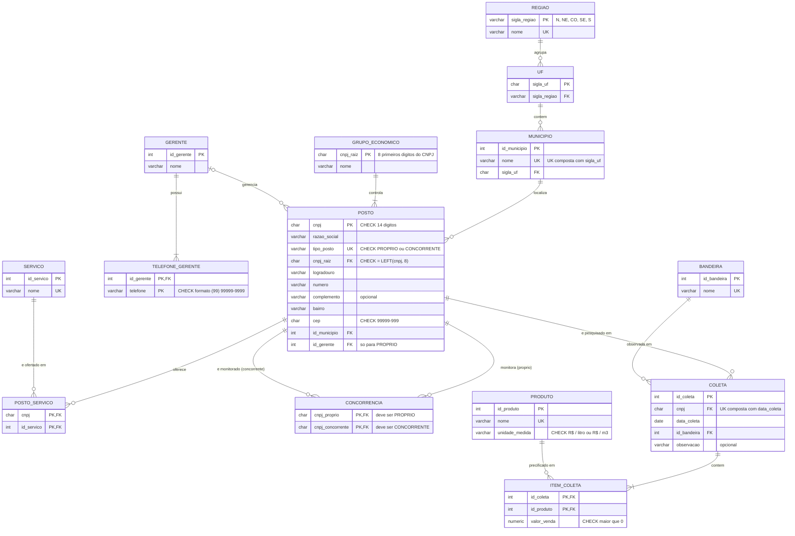

# DER — Modelo Relacional da Rede Maré Combustíveis (3FN)

O diagrama abaixo representa o modelo lógico resultante da normalização documentada em `normalizacao.md` e implementado em `sql/01_ddl.sql`. Ele renderiza automaticamente no GitHub (blocos `mermaid`) e no [Mermaid Live Editor](https://mermaid.live).

## Regras de negócio e cardinalidades

| Relacionamento | Cardinalidade | Regra de negócio |
|---|---|---|
| Região → UF | 1:N | Uma região agrupa várias UFs; cada UF pertence a uma única região. |
| UF → Município | 1:N | Um município pertence a uma única UF. |
| Município → Posto | 1:N | Um posto fica em um único município; um município tem vários postos. |
| Grupo Econômico → Posto | 1:N (obrigatório) | Todo posto pertence ao grupo da sua raiz de CNPJ; todo grupo tem ao menos um posto. |
| Gerente → Posto | 0..1 : 0..N | Só postos próprios têm gerente; um gerente pode estar sem posto (ex.: após substituição). |
| Gerente → Telefone | 1:N | **Entidade fraca:** o telefone não existe sem o gerente. |
| Posto ↔ Serviço | N:M | Um posto oferece vários serviços; um serviço é oferecido por vários postos. Resolvido por `POSTO_SERVICO`. |
| Posto ↔ Posto (Concorrência) | N:M | **Auto-relacionamento:** um posto próprio monitora vários concorrentes; um concorrente pode ser monitorado por vários postos próprios. |
| Posto → Coleta | 1:N | Um posto é pesquisado várias vezes; cada coleta é de um único posto em uma data (UK). |
| Bandeira → Coleta | 1:N | A bandeira é a **observada no dia** da coleta, pois o posto pode trocar de bandeira. |
| Coleta → Item da Coleta | 1:N (obrigatório) | **Entidade fraca:** o item não existe sem a coleta; toda coleta tem ao menos um preço. |
| Produto → Item da Coleta | 1:N | Um produto é precificado em várias coletas; o item guarda o preço daquele produto naquela coleta. |

## Diagrama

## Leitura do diagrama

O modelo tem um **núcleo transacional** (`POSTO` → `COLETA` → `ITEM_COLETA`), que registra os preços pesquisados. Ao redor dele ficam as **dimensões de contexto**: localização, grupo econômico, bandeira e produto. As informações **internas da Rede Maré** (gerente, telefones, serviços e concorrência) aparecem em tabelas separadas. Assim, os dados públicos da ANP e os dados da empresa não se misturam mais numa mesma linha, que era a causa raiz das anomalias da planilha.
